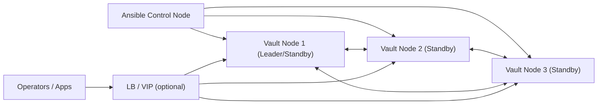

# Project: HashiCorp Vault RAFT Cluster on RedOS 8 (VMware 7.0.3, on-prem)

## 1. Цель проекта
Подготовить воспроизводимый Ansible-плейбук для развертывания и первичной эксплуатации кластера HashiCorp Vault в on-prem инфраструктуре VMware 7.0.3 на базе RedOS 8, где:
- ВМ уже созданы.
- На ВМ настроена только сеть.
- Необходимо выполнить обновление ОС, базовую настройку хостов, установку Vault и конфигурацию HA-кластера на встроенном RAFT-хранилище.

## 2. Бизнес-результат
- Быстрый и повторяемый запуск защищенного Vault-кластера без ручных операций.
- Сокращение риска конфигурационных ошибок.
- Готовая база для дальнейшей интеграции с приложениями, CI/CD и платформенными сервисами.

## 3. Область охвата
В рамках проекта:
- Подготовка ОС RedOS 8: обновления, пакеты, базовый hardening, системные настройки.
- Установка и настройка HashiCorp Vault.
- Настройка TLS, RAFT-кластера и сервиса `vault` (systemd).
- Инициализация кластера и процесс unseal (уточняется по целевой модели).
- Проверки работоспособности, отказоустойчивости и базовой безопасности.
- Документация и эксплуатационные инструкции.

Вне рамок (на текущем этапе):
- Интеграция с конкретными бизнес-приложениями.
- Миграция существующих секретов.
- Полноценный DR на удаленную площадку (может быть отдельным этапом).

## 4. Ограничения и вводные
- Платформа: VMware vSphere 7.0.3 (on-prem).
- ОС: RedOS 8.
- ВМ готовы, сеть базово настроена.
- Требования безопасности и комплаенса уточняются.
- Предпочтение: максимально идемпотентные роли и атомарные шаги в Ansible.

## 5. Целевая архитектура

### 5.1 Рекомендуемый минимальный контур
- 3 узла Vault (prod-like минимум для RAFT quorum).
- Отдельная группа узлов для кластера Vault.
- Опционально: выделенный `bastion/ansible-control` для запуска плейбуков.

### 5.2 Логическая схема


### 5.3 Ключевые компоненты
- **Vault binary/service**: установка из доверенного источника, pinned version.
- **RAFT storage**: встроенное хранилище с peer discovery через статическую конфигурацию.
- **TLS**: обязательный TLS на API и cluster traffic.
- **System hardening**: firewall, лимиты, sysctl, audit/журналирование.
- **Monitoring hooks**: readiness/health checks, метрики и логирование (минимум на уровне health endpoint).

## 6. Нефункциональные требования

### 6.1 Безопасность
- Принцип минимальных привилегий.
- Секреты/ключи не хранятся в открытом виде в репозитории.
- Настройки TLS соответствуют внутренним требованиям PKI.
- Отключение небезопасных дефолтов, контроль доступа к systemd unit и файлам Vault.

### 6.2 Производительность и доступность
- HA через RAFT quorum.
- Настройка параметров ОС для стабильной работы сервиса.
- Предусмотреть тесты лидерства/перевыбора при остановке активного узла.

### 6.3 Консистентность и поддерживаемость
- Единый стиль ролей и переменных Ansible.
- Идемпотентность всех задач.
- Строгое разделение `defaults`, `vars`, `templates`, `handlers`.
- Version pinning и явные changelog-записи при изменениях.

## 7. Технологии и стандарты
- **Ansible** (playbooks, roles, inventories, group_vars/host_vars).
- **HashiCorp Vault** (RAFT storage, TLS, systemd service).
- **RedOS 8 tooling** (`dnf`, `systemd`, `firewalld`, `chronyd`, `auditd`, SELinux-политики при необходимости).
- **Контроль качества**:
  - `ansible-lint`
  - `yamllint`
  - (опционально) Molecule для тестирования ролей
- **Секреты в Ansible**: `ansible-vault` или внешний секрет-менеджер (уточняется).

## 8. План разработки (этапы)
1. **Discovery и финализация требований**
   - Сбор параметров инфраструктуры, безопасности и эксплуатационных требований.
2. **Подготовка репозитория плейбука**
   - Структура ролей, inventory, шаблоны конфигов, стандарты линтинга.
3. **Роль baseline ОС**
   - Обновление ОС, пакеты, hardening, time sync, firewall, системные лимиты.
4. **Роль установки Vault**
   - Поставка бинарника/пакета, пользователь/группы, директории, systemd unit.
5. **Роль конфигурации Vault**
   - `vault.hcl`, TLS, RAFT stanza, join/cluster bootstrap.
6. **Bootstrap процедуры**
   - Init/unseal, проверка статуса, фиксация operational runbook.
7. **Валидация и приемка**
   - Health checks, failover checks, security checks.
8. **Передача в эксплуатацию**
   - Документация, known issues, backlog улучшений.

## 9. Стандарты реализации и архитектурные принципы
- **SOLID/KISS/DRY** в структуре ролей и шаблонов.
- Минимизация дублирования переменных и задач.
- Четкие интерфейсы ролей (входные переменные, ожидаемые артефакты).
- Любое изменение архитектуры сопровождается обновлением этого файла.

## 10. Плановая структура репозитория плейбука
```text
.
├── docs/
├── inventories/
│   ├── prod/
│   │   ├── hosts.yml
│   │   ├── group_vars/
│   │   └── host_vars/
├── playbooks/
│   ├── site.yml
│   ├── os-baseline.yml
│   └── vault-cluster.yml
├── roles/
│   ├── os_baseline/
│   ├── vault_install/
│   ├── vault_config/
│   └── vault_bootstrap/
└── .ansible-lint / .yamllint / pre-commit config
```

## 11. Критерии готовности (DoD)
- Плейбук поднимает кластер Vault из чистых RedOS 8 ВМ (с сетью) без ручных правок.
- Все роли идемпотентны.
- TLS включен и валиден по внутренней PKI-политике.
- Узлы объединяются в RAFT-кластер, лидер выбирается корректно.
- Описаны runbook и шаги восстановления.

## 12. Политика актуализации документа
- Обновлять `Project.md` при изменениях:
  - архитектуры,
  - требований безопасности,
  - нефункциональных ограничений,
  - процесса bootstrap/операционной модели.
- Каждое изменение фиксировать в `docs/changelog.md`.

